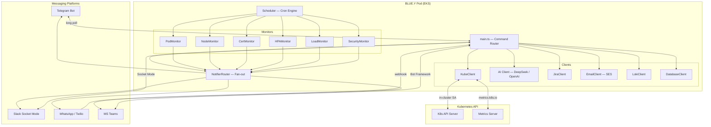

# BLUE.Y — AI Ops Assistant for Kubernetes

> **BLUE.Y asks _why_, so you don't have to.**

[](LICENSE)
[](https://nodejs.org)
[](https://www.typescriptlang.org)
[](https://artifacthub.io/packages/helm/blue-y/blue-y)
[](https://artifacthub.io/packages/helm/blue-y/blue-y)
[](https://github.com/bluey-ai/blue.y)

BLUE.Y is a 24/7 AI-powered Kubernetes operations assistant that monitors your EKS cluster, auto-diagnoses incidents, and lets your on-call engineer respond via **Telegram**, **Slack**, **WhatsApp**, or **Microsoft Teams** — no VPN, no kubectl access required.

---

## Why BLUE.Y?

| Without BLUE.Y | With BLUE.Y |
|---|---|
| Pod crashes at 3 AM → PagerDuty wakes you → you VPN in → `kubectl describe` → logs → guess | BLUE.Y detects the crash, gathers describe + logs + events, runs AI analysis, sends a diagnosis with a root-cause suggestion — before you've opened your eyes |
| "Is the cluster okay?" requires someone with kubectl access | Any team member can ask `/status` on Telegram |
| Scaling decisions are manual and delayed | BLUE.Y monitors HPA pressure and alerts before pods run out of headroom |
| Incidents are tribal knowledge | Every diagnosis is saved, shareable via `/email` or `/jira` |

---

## Features

### Monitors (fully automatic, cron-scheduled)

| Monitor | Schedule | What it detects |
|---------|----------|----------------|
| **Pods** | Every 2 min | CrashLoopBackOff, OOMKilled, ImagePullBackOff, high restart counts |
| **Nodes** | Every 5 min | NotReady, MemoryPressure, DiskPressure, PIDPressure |
| **Certs** | Every 6 hours | TLS certificate expiry via cert-manager (warns at 14 days, critical at 7) |
| **HPA** | Every 5 min | Autoscaler at max replicas, CPU/memory >= 70% (warn) or 85% (critical) |
| **Load** | Every 2 min | Node group CPU pressure, auto-scaling headroom |
| **Security** | Every 3 min | WAF blocked request spikes, auth failure bursts, rate limit triggers |

### Commands (Telegram / Slack)

```
/status          — Cluster health overview
/check           — Run all monitors now
/nodes           — Node CPU/memory breakdown
/resources [ns]  — Pod resource usage + HPA summary
/hpa [ns]        — Autoscaler current vs target
/logs <pod>      — Tail last 30 lines
/logsearch <pod> <pattern>  — Search last 500 lines
/describe <pod>  — Pod details
/events [ns]     — Recent K8s events
/diagnose <pod>  — Full AI diagnosis (describe + logs + events + AI)
/restart <dep>   — Rolling restart (requires /yes confirmation)
/scale <dep> <N> — Scale replicas (requires /yes confirmation)
/email <address> — Email incident report
/jira            — Create Jira ticket from last incident
/incidents       — Incident timeline
/sleep / /wake   — Pause/resume monitoring
/help            — All commands
```

### AI-Powered Auto-Diagnosis

When a critical pod issue is detected, BLUE.Y automatically:
1. Sends an initial alert
2. Gathers `kubectl describe`, last 50 log lines, and recent events
3. Sends raw diagnostics to your chat
4. Runs AI analysis (DeepSeek R1 reasoner by default — any OpenAI-compatible endpoint works)
5. Delivers a root-cause hypothesis with suggested remediation
6. Applies a 15-minute per-pod cooldown to prevent alert fatigue

### Optional Integrations

- **Jira** — create incident tickets with one command
- **Grafana** — embed dashboard URLs in alerts; reset passwords via `/grafana`
- **Loki** — full-text log search across all pods
- **AWS WAF** — auto-block malicious IPs, view block reports
- **Database read-only access** — ask questions in natural language: `/db how many users signed up today?`
- **CI/CD triggers** — trigger Bitbucket Pipelines from chat
- **Smoke tests** — `/smoketest` checks all production URLs
- **AWS SES email** — send incident reports to any verified address

---

## Architecture



---

## Quick Start

### Prerequisites

- Kubernetes cluster (EKS, GKE, AKS, or any K8s 1.24+)
- Node.js 22+ (for local dev)
- A Telegram bot token (from [@BotFather](https://t.me/BotFather))
- A DeepSeek API key (free tier: [platform.deepseek.com](https://platform.deepseek.com)) — or any OpenAI-compatible endpoint

### Option A — Helm (recommended)

```bash
# 1. Add the repo
helm repo add bluey https://bluey-ai.github.io/blue.y
helm repo update

# 2. Install with your values
helm install blue-y bluey/blue-y \
  --namespace monitoring \
  --create-namespace \
  --set ai.apiKey="your-deepseek-key" \
  --set telegram.botToken="your-bot-token" \
  --set telegram.chatId="your-chat-id" \
  --set kube.clusterName="my-cluster"
```

Or use a values file:

```bash
cp helm/blue-y/values.yaml my-values.yaml
# edit my-values.yaml
helm install blue-y bluey/blue-y -f my-values.yaml -n monitoring --create-namespace
```

### Option B — Raw Kubernetes manifests

```bash
# 1. Create the secret
kubectl create secret generic blue-y-secrets -n monitoring --create-namespace \
  --from-literal=ai-api-key="your-deepseek-key" \
  --from-literal=telegram-bot-token="your-bot-token" \
  --from-literal=telegram-chat-id="your-chat-id"

# 2. Apply manifests
kubectl apply -f deploy/deployment_production.yaml
```

### Option C — Local development

```bash
git clone https://github.com/bluey-ai/blue.y.git
cd blue.y
npm install
cp .env.example .env    # fill in your values
npm run dev             # hot-reload via ts-node
```

---

## Configuration

Copy `.env.example` to `.env` and fill in your values. All configuration is via environment variables — no config files to commit.

### Required

| Variable | Description |
|----------|-------------|
| `AI_API_KEY` | DeepSeek (or any OpenAI-compatible) API key |
| `TELEGRAM_BOT_TOKEN` | Telegram bot token from @BotFather |
| `TELEGRAM_CHAT_ID` | Authorized Telegram chat/group ID |

### Kubernetes

| Variable | Default | Description |
|----------|---------|-------------|
| `KUBE_IN_CLUSTER` | `true` | Use in-cluster ServiceAccount (set `false` for local dev) |
| `WATCH_NAMESPACES` | `default,monitoring` | Comma-separated namespaces to monitor |
| `CLUSTER_NAME` | `my-eks-cluster` | EKS cluster name (used for node group detection) |
| `AWS_REGION` | `us-east-1` | AWS region (for EKS node group API calls) |

### AI

| Variable | Default | Description |
|----------|---------|-------------|
| `AI_BASE_URL` | `https://api.deepseek.com/v1` | Any OpenAI-compatible endpoint |
| `AI_ROUTINE_MODEL` | `deepseek-chat` | Fast model for routine queries |
| `AI_INCIDENT_MODEL` | `deepseek-reasoner` | Reasoning model for incident diagnosis |
| `AI_MAX_TOKENS` | `2048` | Max tokens per AI response |
| `AI_SYSTEM_CONTEXT` | — | Cluster-specific context injected into every AI prompt |

### Optional Integrations

| Variable | Description |
|----------|-------------|
| `SLACK_BOT_TOKEN` / `SLACK_APP_TOKEN` / `SLACK_CHANNEL_ID` | Slack Socket Mode (no public URL needed) |
| `TEAMS_APP_ID` / `TEAMS_APP_PASSWORD` / `TEAMS_TENANT_ID` | Microsoft Teams Bot Framework |
| `JIRA_BASE_URL` / `JIRA_EMAIL` / `JIRA_API_TOKEN` / `JIRA_PROJECT_KEY` | Jira ticket creation |
| `LOKI_URL` | Loki log aggregation endpoint |
| `GRAFANA_INTERNAL_URL` / `GRAFANA_EXTERNAL_URL` / `GRAFANA_ADMIN_PASSWORD` | Grafana integration |
| `DB_READONLY_USER` / `DB_READONLY_PASSWORD` / `DATABASE_REGISTRY` | Read-only DB access |
| `WAF_WEB_ACL_NAME` / `WAF_SCOPE` / `WAF_REGION` | AWS WAF auto-blocking |
| `BB_TOKEN` / `BB_WORKSPACE` / `BB_PIPELINES` | Bitbucket Pipelines triggers |
| `VISION_API_KEY` / `VISION_MODEL` | Vision AI for screenshot/image analysis (Google Gemini free tier) |
| `TWILIO_ACCOUNT_SID` / `TWILIO_AUTH_TOKEN` / `TWILIO_WHATSAPP_FROM` | WhatsApp via Twilio |
| `EMAIL_FROM` | SES sender address for `/email` reports |
| `PRODUCTION_URLS` | JSON array of URLs for `/smoketest` |
| `PING_SERVICE_MAP` | JSON map for `/ping <service>` |
| `LOAD_WATCH_LIST` | JSON array of deployments to watch for memory/CPU pressure |

See [`.env.example`](.env.example) for the full reference with descriptions and examples.

---

## Deployment — Helm Chart

The Helm chart at [`helm/blue-y/`](helm/blue-y/) supports:

- **Bring-your-own secret**: set `existingSecret.name` to use a pre-created K8s Secret
- **IRSA**: set `serviceAccount.irsaRoleArn` for AWS integrations (WAF, SES, EKS node group API)
- **All integrations**: every env var in `config.ts` is exposed as a Helm value
- **Resource limits**: configurable via `resources.requests/limits`

```yaml
# values.yaml excerpt
ai:
  apiKey: ""           # or use existingSecret
  baseUrl: "https://api.deepseek.com/v1"
  routineModel: "deepseek-chat"
  incidentModel: "deepseek-reasoner"

telegram:
  botToken: ""
  chatId: ""
  adminId: ""

kube:
  clusterName: "my-cluster"
  watchNamespaces: "default,monitoring"
  awsRegion: "us-east-1"

existingSecret:
  name: ""    # set to use your own K8s Secret

serviceAccount:
  irsaRoleArn: ""    # AWS IAM role for IRSA
```

---

## Project Structure

```
blue.y/
├── src/
│   ├── main.ts                    # Entry point, command router, HTTP server
│   ├── config.ts                  # Environment config
│   ├── scheduler.ts               # Cron engine, auto-diagnose, incident timeline
│   ├── slack-bot.ts               # Slack Socket Mode bot
│   ├── clients/
│   │   ├── kube.ts                # Kubernetes API (pods, nodes, HPA, metrics)
│   │   ├── bedrock.ts             # AI client (DeepSeek / OpenAI-compatible)
│   │   ├── email.ts               # AWS SES
│   │   ├── jira.ts                # Jira REST API
│   │   ├── loki.ts                # Loki log queries
│   │   ├── database.ts            # Read-only DB access (MySQL/PostgreSQL)
│   │   ├── db-agents.ts           # Multi-agent SQL pipeline (generate → validate → verify)
│   │   ├── waf.ts                 # AWS WAF
│   │   └── notifiers/
│   │       ├── interface.ts       # Notifier interface
│   │       ├── telegram.ts        # Telegram notifier
│   │       ├── slack.ts           # Slack notifier
│   │       ├── teams.ts           # MS Teams notifier
│   │       └── whatsapp.ts        # WhatsApp / Twilio notifier
│   ├── monitors/
│   │   ├── base.ts                # Monitor interface
│   │   ├── pods.ts                # Pod health
│   │   ├── nodes.ts               # Node health
│   │   ├── certs.ts               # TLS certificate expiry
│   │   ├── hpa.ts                 # HPA utilization
│   │   ├── load.ts                # Load + node group auto-scaling
│   │   └── security.ts            # WAF + auth failure monitoring
│   └── utils/
│       └── logger.ts              # Winston logger
├── helm/blue-y/                   # Helm chart
├── deploy/                        # Raw K8s manifests
├── docs/CHANGELOG.md              # Release history
├── .env.example                   # Full environment variable reference
├── CONTRIBUTING.md
├── SECURITY.md
└── CODE_OF_CONDUCT.md
```

---

## RBAC

BLUE.Y uses a minimal ClusterRole (`blue-y-readonly`) with read-only access plus deployment patching:

```yaml
rules:
  - apiGroups: [""]
    resources: [pods, nodes, events, namespaces, secrets, services, endpoints]
    verbs: [get, list, watch]
  - apiGroups: [apps]
    resources: [deployments, replicasets, statefulsets, daemonsets]
    verbs: [get, list, watch, patch]
  - apiGroups: [autoscaling]
    resources: [horizontalpodautoscalers]
    verbs: [get, list, watch]
  - apiGroups: [metrics.k8s.io]
    resources: [pods, nodes]
    verbs: [get, list]
```

Restart and scale actions use `kubectl patch` (not `kubectl exec`). `kubectl delete` is blocked at the application layer.

---

## Safety

- **Confirmation required**: `/restart` and `/scale` need explicit `/yes`
- **Action limit**: configurable max actions per hour (`MAX_ACTIONS_PER_HOUR`, default 5)
- **Blocked commands**: `kubectl delete pvc/namespace/node`, `kubectl drain`, `kubectl cordon`
- **Audit log**: all actions logged (last 1000 entries, accessible via `GET /audit`)
- **Non-root container**: runs as `bluey` user (UID 1001)
- **RBAC**: read-only by default, patch only for deployments

---

## API Endpoints

| Endpoint | Method | Description |
|----------|--------|-------------|
| `/health` | GET | Health check (status, uptime, version) |
| `/check` | POST | Trigger all monitors immediately |
| `/audit` | GET | Audit log (last 100 entries) |

---

## Community vs Premium

BLUE.Y is open-source and free forever. A premium edition exists for teams that need an admin dashboard.

| Feature | Community | Premium |
|---------|:---------:|:-------:|
| Pod / Node / Cert / HPA / Load / Security monitors | ✅ | ✅ |
| Telegram, Slack, WhatsApp, MS Teams | ✅ | ✅ |
| AI auto-diagnosis (DeepSeek / any OpenAI endpoint) | ✅ | ✅ |
| Jira, Grafana, Loki, AWS WAF, SES, SMTP | ✅ | ✅ |
| Helm chart (ArtifactHub) | ✅ | ✅ |
| `/restart`, `/scale`, `/diagnose`, all chat commands | ✅ | ✅ |
| Docker image | `ghcr.io/bluey-ai/blue.y` (public) | Private ECR |
| **Admin web dashboard** (cluster topology, real-time monitoring) | ❌ | ✅ |
| **ChatOps magic-link auth** (`/admin` → magic link → click → dashboard) | ❌ | ✅ |
| **Dynamic IP access mode** (no VPN required) | ❌ | ✅ |
| **Incident log UI** (searchable SQLite timeline) | ❌ | ✅ |
| **Config editor** (hot-reload without pod restart) | ❌ | ✅ |
| **Premium Helm chart** (private, includes ingress + admin config) | ❌ | ✅ |

### How licensing works

**Community**: the admin code does not exist in the community image — there is no feature flag to flip, nothing to crack. You get the full monitoring and chat experience forever, free.

**Premium**: contact [hello@bluey.ai](mailto:hello@bluey.ai) to receive ECR pull credentials + the premium Helm chart.

---

## Contributing

See [CONTRIBUTING.md](CONTRIBUTING.md) for branch naming, version bumping, and PR checklist.

```bash
git clone https://github.com/bluey-ai/blue.y.git
cd blue.y
npm install
cp .env.example .env
npm run dev
```

To add a custom monitor: implement `Monitor` from `src/monitors/base.ts`, add it to `src/main.ts`.
To add a notifier: implement `Notifier` from `src/clients/notifiers/interface.ts`, add it to `NotifierRouter`.

---

## License

Apache 2.0 — see [LICENSE](LICENSE).

Built by [BlueOnion](https://www.blueonion.today) and open-source contributors.
